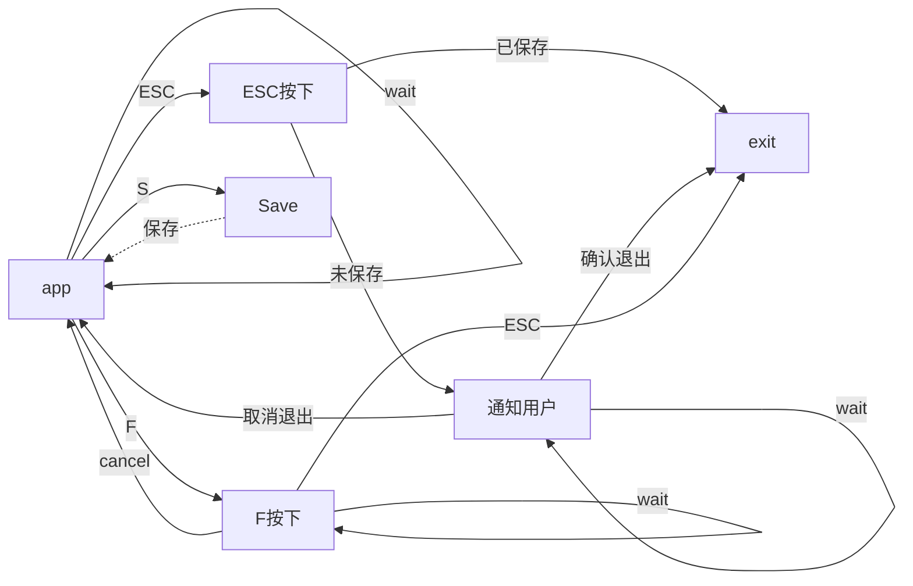
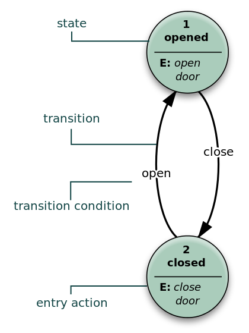

# 从一个例子出发

假如我们在写某软件的快捷键功能，用户可以按下快捷键直接进行操作。

比如按下 `ESC` 退出，按下 `S` 键保存

```C++
if (input == "esc") {
    app.exit()
} else if (input == "s") {
    app.save()
}
```

等下，如果我们不小心直接按下了 `ESC` 那么我们所做的不就功亏一篑了，所以我们还需要这么加

- 在你已经保存情况下，可以退出软件

- 在你没有保存的时候，提醒你保存软件，然后用户决定是否退出

我们会这样写

```C++
if (input == "ESC") {
    if (document.saved) {
        app.exit()
    } else {
        var stateYes = function () {
            // 当用户确定时候执行函数
            app.exit()
            app.notice.hide()
        }
        var stateNo = function () {
            app.notice.hide()
        }
        app.notice(title = "你真的要不保存退出吗？", stateYes, stateNo)
    }
} else if (input == "S") {
    app.save()
}
```


看起来很简单，但是随着我们的软件开发，快捷键也变多了，出现了这样的需求

- 按下 `F` 之后再按下 `ESC` 强制退出软件

```C++
if (inputs[0] == "F") {
    if (inputs[1] == "ESC") {
        app.exit()
    }
} else if (inputs[0] == "ESC") {
    if (document.saved) {
        app.exit()
    } else {
        var stateYes = function () {
            // 当用户确定时候执行函数
            app.exit()
            app.notice.hide()
        }
        var stateNo = function () {
            app.notice.hide()
        }
        app.notice(title = "你真的要不保存退出吗？", stateYes, stateNo)
    }
} else if (inputs[0] == "S") {
    app.save()
}
```

OK，我们的需求还在增加，然而我们仅仅用一个巨大的判断语句，增加了重构的难度，也难以阅读。

我们这样写有很大的问题，每次我们添加、更换需求时候，我们都会不经意的破坏我们已有的代码结构。

那么有什么办法来拯救我们需求呢？？？

## 有限状态机

我们重新设计我们的需求，用线和框把他们梳理一下...



这就是有限状态机

> 有限状态机（英语：finite-state machine，缩写：FSM）又称有限状态自动机，简称状态机，是表示有限个状态以及在这些状态之间的转移和动作等行为的数学模型。

我们发现其特征：

1. 你有一组状态，你还可以在这些状态之间切换。例如：你在通知界面候点击取消就会返回到app，点击确认就会退出

2. 状态机某一时刻只能处于某一状态。比如我们不可能同时处于ESC按下和Save两种状态

3. 状态会接受一种输入，在这里就是 `S` `F` `ESC`

4. 每种状态都有一种转换，每一种转换都关联着一个输入并指向另 一个状态



我们用一个五元组表示：$(\Sigma, S, s_0, \delta, F)$

- $\Sigma$ 为字母表

- $S$ 是状态的非空有限集合

- $s_0$ 是初始状态

- $\delta$ 是状态的转移函数

- $F$ 是最终状态的集合

## 代码实现

```C++
class State {
public:
    virtual ~State() {}
    virtual void handleInput(App& app, Input input) {}
}

class FState: State {
public:
    FState() {}
    void handleInput(App& app, Input input) {
        if (input == "cancel") {
            app.setDefaultState()
        } else if (input == "esc") {
            app.exit()
        }
    }
}

class ESCState: State {
public:
    ESCState() {}
    void handleInput(App& app, Input input) {
        if (app.saved) {
            app.exit()
        } else {
            var stateYes = function () {
                app.exit()
                app.notice.hide()
            }
            var stateNo = function () {
                app.notice.hide()
            }
            app.noticeState(title = "你真的要不保存退出吗？", stateYes, stateNo)
        }
    }
}
// 省略
```

然后我们在app中调用

```C++
class App {
public:
    ...
    void handleInput(Input input) {
        ...
        state_->handleInput(*this, input)
        ...
    }
    ...
private:
    State state_;
}
```

## 后记

本篇是7月份的写完的文章，当时想着用OI的方式再说一遍，但是一直到了现在还没有什么起色，于是就这样发出来吧